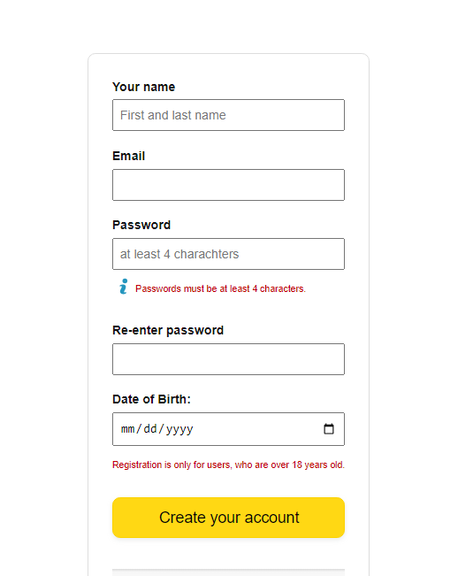

# Testing the registration form

_project about testing e2e the registration form_

<br>

## 🌟 About

This project is for educational porpuses only. 
In the studying process, I wrote tests that involve the use of browser automation to simulate the behavior of real user, effectively reproducing the steps a visitor can take when filling out a registration form.
Pull request are welcome, but priority for project authors! Thank you for your cooperation!

Site published at: https://liliiavint.github.io/registration-form-test/

Design: none

## 🎯 Project features/goals

- Vite: Build tooling framework for modern web projects.
- Cypress: Testing framework for web applications.
- GitHub Pages: Hosting platform for static websites.
- ES6++ (JavaScript): Usage of modern JavaScript features.

### 💻 Prerequisites

Node.js - _download and install_
```
https://nodejs.org
```
Git - _download and install_
```
https://git-scm.com
```

### 🏃 Run locally

Would like to run this project locally? Open terminal and follow these steps:

1. Clone the repo
    ```sh
    git clone https://github.com/liliiavint/registration-form-test.git
    ```
2. Install NPM packages
    ```sh
    npm i
    ```
    or
    ```sh
    npm install

3. Cypress - _install_
    ```
    npm install cypress --save-dev

4. Run the server
    ```sh
    npm run dev

When you visit  http://localhost:5173/ in your browser, you will be greeted with the application homepage:
    ```
    

```
This demo project is designed with a simplistic user registration.
```
## 🧪 Running tests

 # Test e2e
    lokaly doing test
    npm run test

    doing with gihub action
    npm run test:ci

### 🎅 Authors

Liliia: [Github](https://github.com/liliiavint)

