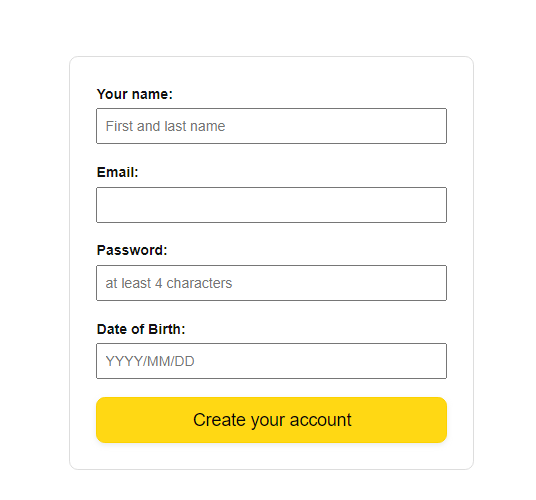

# Testing the registration form

_project about testing e2e the registration form_

<br>

## 🌟 About

This project is for educational porpuses only. 
In the studying process, I wrote tests that involve the use of browser automation to simulate the behavior of real user, effectively reproducing the steps a visitor can take when filling out a registration form.
Pull request are welcome, but priority for project authors! Thank you for your cooperation!

Site published at: https://liliiavint.github.io/registration-form-test/

Design: none

## 🎯 Project features/goals

- Vite: Build tooling framework for modern web projects.
- Cypress: Testing framework for web applications.
- GitHub Pages: Hosting platform for static websites.
- ES6++ (JavaScript): Usage of modern JavaScript features.

### 💻 Prerequisites

Node.js - _download and install_
```
https://nodejs.org
```
Git - _download and install_
```
https://git-scm.com
```

### 🏃 Run locally

Would like to run this project locally? Open terminal and follow these steps:

1. Clone the repo
    ```sh
    git clone https://github.com/liliiavint/registration-form-test.git
    ```
2. Install NPM packages
    ```sh
    npm i
    ```
    or
    ```sh
    npm install

3. Cypress - _install_
    ```
    npm install cypress --save-dev

4. Run the server
    ```sh
    npm run dev

When you visit  http://localhost:5173/ in your browser, you will be greeted with the application homepage:
    ```
    

```
This demo project is designed with a simplistic user registration.
```
# Registration Form Test Case

## Objective
Ensure the registration form captures user information accurately and securely, facilitating successful user registration.

### Requirements
Gather requirements for the registration form, including mandatory fields, input validation rules, and error handling scenarios.

## Test Plan

### Scope
Determine the scope of testing, including the registration form fields, validation rules, and submission process.

### Test Environment
Specify the browsers and devices to be tested, along with any necessary test data or mock APIs.

### Test Strategy
Plan for both positive and negative test scenarios, covering valid input, invalid input, edge cases, and error conditions.

### Metrics
Define metrics and criteria for evaluating the registration form's functionality, such as form completion rate and error rate.

## Test Design

### Test Scenarios
Design test scenarios to cover all aspects of the registration form, including field validations, submission, and error handling.

### Test Data
Create test data sets for different test scenarios, including valid and invalid input combinations.

### Reusable Components
Identify reusable test components or fixtures to optimize test script maintenance.

## Test Cases Development

### Positive Test Case
Write a Cypress test case to verify successful submission of the registration form with valid input.

### Negative Test Cases
Develop test cases to validate error messages and handling for scenarios such as missing required fields or invalid input.

### Assertions
Implement assertions to validate expected behavior, such as the appearance of success messages or error notifications.

## Test Execution

### Automated Testing
Execute Cypress tests against the registration form in different browsers and environments.

### Debugging
Investigate and debug any test failures encountered during execution, using Cypress's debugging features and test logs.

## Test Summary Report

### Results
Generate a summary report detailing the outcomes of the registration form tests, including pass/fail status, defects found, and test coverage.

### Analysis
Analyze test results to identify trends, patterns, and areas for improvement in the registration form functionality.

### Recommendations
Provide recommendations for enhancing the registration form based on test findings and user feedback.

## Test Management

### Version Control
Manage Cypress tests using version control systems like Git to track changes and collaborate with team members.

### Test Suites
Organize test suites and prioritize test cases based on their criticality and impact on the registration form's functionality.

### Continuous Improvement
Continuously update and maintain the test suite to accommodate changes in the registration form or application requirements, ensuring ongoing quality assurance.

## 🧪 Running tests

 # Test e2e
    lokaly doing test
    npm run test

    doing with gihub action
    npm run test:ci

### 🎅 Authors

Liliia: [Github](https://github.com/liliiavint)

